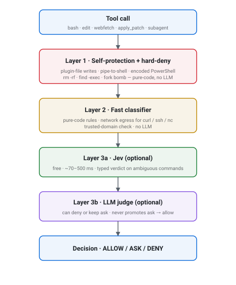

<div align="center">

# opencode-auto-guard

**A defensive guard for OpenCode v2 — classifies every shell command, web request, and file action before it runs.**

[](https://github.com/juanfranem/opencode-auto-guard/actions/workflows/ci.yml)
[](https://github.com/juanfranem/opencode-auto-guard/releases)
[](LICENSE)
[](https://opencode.ai)



[Install](#install) · [How it works](#how-it-works) · [Configure](#configure) · [FAQ](#faq) · [Security model](docs/SECURITY.md)

</div>

---

When an LLM agent runs `bash` or fetches a URL, a single bad command can wipe a disk, exfiltrate a token, or quietly leak context into a prompt-injection payload. **opencode-auto-guard** sits between OpenCode and every risky tool call: a pure-code fast classifier handles the obvious cases, an optional structured-decision judge (Jev) handles ambiguous shell commands, an optional LLM judge handles the rest, and the plugin refuses to tamper with itself.

It is **conservative by default**: when in doubt, it asks you. It never silently allows.

---

## At a glance

| Layer | Behaviour |
|---|---|
| Self-integrity | Pin mismatch detected → refuses to register hooks. OpenCode falls back to base permissions. |
| Self-protection | `read` / `edit` / `write` / `apply_patch` over the plugin's own files or your `opencode.jsonc` → **deny**. |
| Shell — fast classifier | Pure-code patterns (no LLM). Catches pipe-to-shell, `rm -rf /`, `find -exec`, base64 payloads, fork bombs, encoded PowerShell. |
| Shell — network egress | `curl`, `wget`, `ssh`, `nc`, `nslookup`, … → host extracted (including jump hosts in `-J`) and checked against `trustedDomains`. Non-trusted → **ask**. |
| Shell — fast structured judge _(optional)_ | Calls Jev (free, ~70–500 ms) for ambiguous commands. Typed `deny` / `ask` / `unsure`. Falls through to the LLM judge on low confidence. |
| Shell — LLM judge _(optional)_ | Calls your configured model for ambiguous commands. Can only **deny** or keep **ask**. Never **allow**. Rate-limited to 20 calls per session. |
| Webfetch / Websearch | Trusted domains pass without asking. Others → **ask**. Output from non-trusted sources wrapped in `<untrusted-source url="...">` so the agent treats it as data, not instructions. |
| TOCTOU | `tool.execute.before` re-checks file paths via `realpath` to detect symlink swap. |
| Per-agent policy | `build` / `plan` agents never elevate `ask → allow`. Only the `auto` agent uses the deterministic allowlist for auto-approval. |
| Session limits | `3` denials or `250` counted actions → session pauses. Counted actions: `bash`, `edit`, `write`, `apply_patch`, `webfetch`, `websearch`, `subagent`. Read-only actions are not counted. |
| Context guard | Pauses when main-agent context reaches `60%` of the model's window. On pause, dumps the conversation and auto-invokes the `compact-context-guard` skill so you can resume in a fresh session. |
| Audit | Hash-chained, tamper-evident log of every decision. Auto-rotates at 10 000 entries (keeps 5 000 most recent + archives older). |
| Caching | LRU+TTL cache (`60 s`, 1 000 entries) for `isSafe()` results. |

---

## Install

### Recommended — GitHub Releases (no auth, public install)

```bash
opencode plugin add github:juanfranem/opencode-auto-guard#v0.1.0
```

Pick any tag from the [Releases page](https://github.com/juanfranem/opencode-auto-guard/releases); the release workflow attaches the package tarball to every release, so any tag is installable without a token. The npm name stays `@juanfranem/opencode-auto-guard` regardless of how you install it.

### Alternative — GitHub Packages (npm-compatible)

```bash
opencode plugin add @juanfranem/opencode-auto-guard
```

Requires that your OpenCode install can reach `npm.pkg.github.com` and a token with `read:packages` in your `.npmrc`:

```ini
# ~/.npmrc (or %USERPROFILE%\.npmrc on Windows)
@juanfranem:registry=https://npm.pkg.github.com
//npm.pkg.github.com/:_authToken=<your-github-token>
```

If you don't have a token, use the GitHub Releases path above.

### Local clone (development)

```bash
git clone https://github.com/juanfranem/opencode-auto-guard.git
cd opencode-auto-guard
bun install
opencode plugin add file://.
```

> **Safety note — pin your install.** Set `options.pin` to a SHA-256 of the installed files ([instructions](#configure)). If anything tampers with `index.ts` or `rules.ts`, the plugin silently disables itself instead of running tampered code.

---

## How it works

```
shell command / webfetch / file edit
        │
        ▼
   self-protection (plugin files)?       → deny
   hard-deny patterns (no LLM)?          → deny
   ALWAYS_ASK patterns?                  → ask
   trusted destination?                  → ask if not trusted
   auto-agent allowlist?  (auto only)    → allow
        │
        ▼  worst case so far = ask
   fast structured judge (Jev)           → deny / ask if high confidence
        │
        ▼  else
   LLM judge                             → deny / ask  (never allow)
        │
        ▼
   per-session limits reached?           → session pauses
   context window near full?             → compact-context-guard skill
```

Key invariants:

- The LLM judge **cannot promote `ask → allow`** — only deny or keep ask. If you want allow, it has to come from the deterministic allowlist in `auto` mode.
- The fast classifier (and the hard-deny/ALWAYS_ASK pattern tables) make every decision locally. The LLM judge is called only after the deterministic layers can't resolve the case.
- Webfetch output from non-trusted sources is tagged with `<untrusted-source>` so downstream turns treat it as data, not as instructions.

---

## Configure

Drop the plugin into your `opencode.jsonc`. All options are optional; defaults are conservative.

```jsonc
{
  "$schema": "https://opencode.ai/config.json",
  "plugins": [
    {
      "package": "@juanfranem/opencode-auto-guard",
      "options": {
        "judge": true,
        "model": "anthropic/claude-sonnet-4-5",
        "trustedDomains": ["github.com", "example.com"]
      }
    }
  ]
}
```

Then restart OpenCode — options are read once at startup.

### Options

| Option | Type | Default | What it does |
|---|---|---|---|
| `judge` | bool | `true` | Enable the LLM judge for ambiguous commands. |
| `model` | string | default model | Model used by the LLM judge. Format: `provider/model`. |
| `strictBuild` | bool | `true` | In `build` agent, force `ask` on `ALWAYS_ASK` patterns even if global config would allow. |
| `trustedDomains` | string[] | built-in list | Hosts that pass through `webfetch` / `websearch` and shell network without asking. |
| `protectedPaths` | string[] | plugin files | Absolute paths denied for `read` / `edit` / `write`. |
| `maxDenials` | number | `3` | Session pauses after this many denials. |
| `maxActions` | number | `250` | Session pauses after this many counted actions. |
| `maxContextUsage` | number | `0.6` | Pause when main-agent context reaches this fraction (0–1) of the model window. `0` disables. |
| `compactSessionsDir` | string | `~/.config/opencode/opencode-auto-guard/sessions` | Where the `compact-context-guard` skill writes raw dumps and refined handoffs. |
| `compactOnContextGuard` | bool | `true` | Auto-invoke `compact-context-guard` when the context guard fires. |
| `tempDir` | string | `~/.config/opencode/opencode-auto-guard/tmp` | Scratch directory for the `auto` agent (compiled artefacts, fixtures, logs). Created on startup. |
| `pin` | string | unset | SHA-256 of `index.ts` + `rules.ts`. If set and mismatch → plugin disables. |

<details>
<summary><strong>Fast structured judge (Jev) — advanced</strong></summary>

For ambiguous shell commands, you can layer a free structured-decision model (Jev on OpenCode Zen) **before** the LLM judge. Jev responds in ~70–500 ms with a typed `deny` / `ask` / `unsure` instead of freeform text. The LLM judge stays on as a safety net for low-confidence / `unsure` cases.

```jsonc
{
  "plugins": [
    {
      "package": "@juanfranem/opencode-auto-guard",
      "options": {
        "judge": true,
        "model": "anthropic/claude-sonnet-4-5",
        "fastJudgeModel": "opencode/jev-1.13-free"
      }
    }
  ]
}
```

Auth via `$env:OPENCODE_ZEN_API_KEY` or `fastJudgeApiKey`. Without a key, the fast judge is silently skipped and only the LLM judge runs.

| Option | Default | What it does |
|---|---|---|
| `fastJudgeEndpoint` | `https://opencode.ai/zen/v1/systemone` | Override only for self-hosted. |
| `fastJudgeApiKey` | env var | Bearer token for the fast judge. |
| `fastJudgeTimeoutMs` | `5000` | Per-request timeout. |
| `fastJudgeConfidenceDeny` | `0.75` | Min confidence to short-circuit a `deny`. Lower → fall through to LLM. |
| `fastJudgeConfidenceAsk` | `0.6` | Min confidence to short-circuit an `ask`. Lower → LLM still sees the case. |

**Caveats from the published test report — read these before relying on it:**

- **One injection test, not a guarantee.** Jev passed a basic prompt-injection attempt in the published tests; a single test does not prove resistance to more sophisticated injection. We still treat Jev's output as data, not authority.
- **Forced-choice without `unsure` is dangerous.** Without an "other" / "unsure" option the model picks a confident-wrong answer. We always include `unsure` in the question schema; on `unsure` we fall through to the LLM judge.
- **Confidence ≠ accuracy.** Treat Jev's confidence score as a threshold for *when to ask for a second opinion*, not as a measure of correctness. The audit log records the raw confidence so you can tune `fastJudgeConfidenceDeny` / `fastJudgeConfidenceAsk` against your own workload.
- **Negation is the failure mode to watch.** If you see Jev missing negations in your audit log, raise `fastJudgeConfidenceDeny`.

</details>

<details>
<summary><strong>Pin the installed files (advanced)</strong></summary>

After installing, compute and pin the hash so the plugin refuses to register if its files are tampered with:

```powershell
$index = Get-FileHash "$env:USERPROFILE\.config\opencode\node_modules\opencode-auto-guard\src\index.ts" -Algorithm SHA256
$rules = Get-FileHash "$env:USERPROFILE\.config\opencode\node_modules\opencode-auto-guard\src\rules.ts" -Algorithm SHA256
$combined = [System.BitConverter]::ToString((
  [System.Security.Cryptography.SHA256]::Create().ComputeHash(
    [System.Text.Encoding]::UTF8.GetBytes($index.Hash + "|" + $rules.Hash)
  )
)) -replace "-", ""
"sha256:$combined"
```

Set the result as `options.pin`. If anyone replaces either file, the plugin won't register and OpenCode silently falls back to your base permissions.

</details>

---

## What gets blocked

**Hard-denied (always, regardless of config):**

- `curl … | bash` / `… | sh` / `… | pwsh` / `… | powershell`
- `pwsh -EncodedCommand <base64>`, `powershell -enc <base64>`
- `find / -exec rm {} \;`
- `xargs rm`, `xargs curl`
- `tar --checkpoint-action=exec='evil.sh'`
- `:(){:|:&};:` (fork bomb)
- `reg delete`, `Remove-Item -Recurse -Force \\`
- Reading or writing the plugin's own files, `opencode.jsonc`, etc.

**Always `ask` in `auto` mode:**

- `git push`, `git commit`
- `docker run --privileged`
- `terraform apply`, `kubectl delete`, `aws s3 rm`
- `npm publish`, `cargo publish`
- `ssh user@host`, `scp ./secret user@host:/tmp/`

**Triggers the network-egress check (asks if host is not trusted):**

- `curl https://internal-api.mycompany.com/data` — whitelist `mycompany.com` if legitimate
- `wget https://unknown.example.com/installer`
- `ssh user@bastion.prod.example`
- `ssh -J user@jump user@dest`
- `nc evil.example.com 4444`
- `nslookup evil.example.com`

The host is extracted from URL or `user@host` syntax, **including jump hosts in `-J`**, and matches against the same `trustedDomains` list used for `webfetch`.

## What does NOT get blocked

Out of scope by design. Combine with OS-level isolation for full coverage:

- Network-level exfiltration (`bwrap`, `sandbox-exec`, AppContainer)
- Filesystem isolation (mount namespaces, chroot)
- Credential scoping (least-privilege IAM, short-lived tokens)
- The user can always downgrade to `plan` mode and approve manually
- Adversarial context from webfetch is **always** wrapped as untrusted (`<untrusted-source>`), so the agent's own prompt is the last line of defence

See [`docs/SECURITY.md`](docs/SECURITY.md) for the full threat model.

---

## Context handoff (long sessions)

Long sessions run out of context. When `maxContextUsage` is reached, the plugin:

1. **Denies** the action that crossed the threshold.
2. **Dumps** the conversation to `~/.config/opencode/opencode-auto-guard/sessions/<session-id>/raw-<timestamp>.json`.
3. **Rewrites** the `compact-context-guard` skill content with the concrete paths and timestamps.
4. **Invokes** the skill, which writes a refined markdown compact to `compact-<timestamp>.md` in the same directory.

The refined compact follows a fixed structure the next agent recognises:

```
# Compact Session: <title>          + metadata blockquote
## Original Goal
## Where We Are Now                  (✅ done / 🔄 in progress / ❌ blocked / ⏭️ next)
## Key Decisions Made
## Files Touched
## Pending Questions / Blockers
## Recommended Next Steps
## Context the Next Agent Needs
## Environment Notes
```

The plugin invokes the skill once per session — once paused, it won't re-invoke on subsequent denials. To refresh, run `/compact-context-guard` manually. The skill also ships standalone at `agents/compact-context-guard.md`.

Disable auto-invoke with `compactOnContextGuard: false`, or move the output with `compactSessionsDir`.

---

## Auto mode

The package ships an agent definition (`agents/auto.md`) for routine development — known-safe patterns are auto-approved, the LLM judge can only deny. **Auto** is for trusted, routine work. Switch to **build** for untrusted input and **plan** when you want to approve everything.

OpenCode v2 does not let plugins register agents through `ctx.agent.transform`, so copy the file once:

```powershell
Copy-Item "$env:USERPROFILE\.config\opencode\node_modules\opencode-auto-guard\agents\auto.md" `
  -Destination "$env:USERPROFILE\.config\opencode\agents\auto.md"
```

Then register it in `opencode.jsonc`:

```jsonc
{
  "agents": {
    "auto": {
      "mode": "primary",
      "model": "anthropic/claude-sonnet-4-5",
      "prompt": "{file:./agents/auto.md}",
      "permissions": [
        { "action": "external_directory", "resource": "*", "effect": "ask" },
        { "action": "read", "resource": "*", "effect": "allow" },
        { "action": "edit", "resource": "*", "effect": "allow" },
        { "action": "glob", "resource": "*", "effect": "allow" },
        { "action": "grep", "resource": "*", "effect": "allow" },
        { "action": "shell", "resource": "*", "effect": "ask" },
        { "action": "webfetch", "resource": "*github.com*", "effect": "allow" },
        { "action": "webfetch", "resource": "*", "effect": "ask" }
      ]
    }
  }
}
```

Press **Tab** in the TUI to switch between `build`, `plan`, and `auto`. In `build` and `plan` the plugin never elevates `ask` to `allow`.

The auto agent also gets a known scratch directory at `~/.config/opencode/opencode-auto-guard/tmp/` for compiled artefacts, fixtures, and intermediate logs. Subdirectories inside it are still subject to the regular per-action checks — only the TMP root itself gets the implicit "temp files live here" semantics.

---

## Commands

### `/auto-guard-setup`

Interactive wizard inside the agent. Walks you through the options one question at a time using the native `question` tool, previews the resulting `options` block, then writes it back to `opencode.jsonc` in place.

1. LLM judge (yes / no, default yes)
2. Judge model if Q1 = yes (e.g. `anthropic/claude-sonnet-4-5`)
3. Strict build mode (yes / no, default yes)
4. Context usage limit (`0.0`–`1.0`, default `0.6`)
5. Max denials (default `3`)
6. Max counted actions (default `250`)
7. Extra trusted domains (comma-separated, optional)
8. Pin the plugin SHA-256 (advanced, default no)

After it writes, the wizard reminds you to restart OpenCode — options are read once at startup.

---

## FAQ

**Does this replace OpenCode's built-in permissions?**
No. It runs on top. You still set `permissions` in `opencode.jsonc`; the plugin adds extra per-action classification, network validation, and the audit log.

**Is it safe without the LLM judge?**
Yes. The fast classifier catches the common cases without any LLM call. The LLM judge only handles ambiguous commands; disabling it just means more `ask` prompts.

**Why does the LLM judge never `allow`?**
Because letting an LLM downgrade `ask` to `allow` would silently undo your manual decisions. Allow can only come from the deterministic allowlist in `auto` mode.

**Where does my data go?**
Audit logs and compact handoffs stay in `~/.config/opencode/opencode-auto-guard/`. The LLM judge (and the fast judge, if enabled) sends the command to your configured provider under your credentials. Nothing else is uploaded.

**Why the dual install (GitHub Releases + GitHub Packages)?**
The release tarball is the recommended path because npm installs require a `read:packages` token. Releases let anyone install with no account. GitHub Packages is the fallback for environments that prefer the npm name path.

**Does it work on Windows / macOS / Linux?**
Yes. Patterns are written for both PowerShell and POSIX shells.

---

## Development

```bash
bun install
bun run check             # typecheck + lint + format:check + tests
bun src/tests/evasion-test.ts
bun src/tests/compact-test.ts
bun src/tests/jev-test.ts
opencode plugin add file://.
```

See [`docs/SECURITY.md`](docs/SECURITY.md) for the threat model and out-of-scope items.

## Changelog

See [`CHANGELOG.md`](CHANGELOG.md) for release notes per version.

## License

MIT
